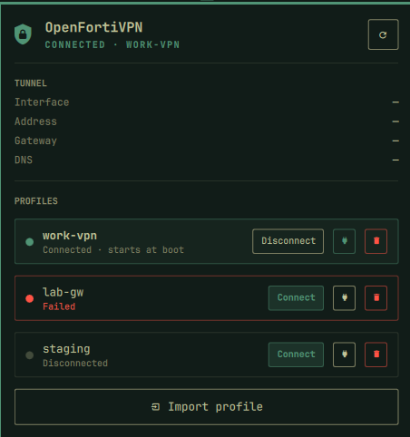

# FortiVPN for Omarchy

A **FortiVPN** client that lives in your Omarchy bar. Connect to your company's
Fortinet SSL VPN, switch between profiles, pick which ones come up at boot, and
import the `.conf` your admin sent you — without opening a terminal.



Under the hood it drives [openfortivpn](https://github.com/adrienverge/openfortivpn),
the open-source FortiGate SSL VPN client, through systemd. That is where the
package name, config paths and unit names throughout this README come from — you
do not have to touch any of them, and the widget installs openfortivpn for you
on first run.

> **Unofficial.** Not affiliated with, authorised by, or endorsed by Fortinet.
> "FortiVPN", "FortiGate" and "FortiClient" are trademarks of Fortinet, Inc.
> This project just automates the open-source `openfortivpn` client.


## Installation

```bash
omarchy plugin add https://github.com/YOUR-GITHUB-USER/omarchy-openfortivpn.git --enable
```

The manifest places the widget on the right side of the bar. To put it
somewhere specific:

```bash
omarchy bar move rhakbari.openfortivpn --before omarchy.network
```

Plugin changes normally hot-reload. If the widget does not appear, run
`omarchy restart shell`. Later, `omarchy plugin update rhakbari.openfortivpn`
and `omarchy plugin remove rhakbari.openfortivpn` manage it.

Nothing else to set up: Omarchy's plugin system has no install hook, so the
widget checks for its `openfortivpn` backend itself on first run. If it is
missing, the panel opens on a **Install openfortivpn** button that installs it
(one polkit prompt) and then continues as normal.

## Requirements

- systemd and a running polkit agent (Omarchy's shell provides one)
- `openfortivpn` — installed for you from the panel on first run, or by hand
  with `sudo pacman -S openfortivpn`

## How it works

Each profile is a `*.conf` file in `/etc/openfortivpn/`, which is exactly what
the packaged `openfortivpn@.service` systemd template expands `%I` into. So a
profile named `work` means:

| Thing | Value |
| --- | --- |
| Config | `/etc/openfortivpn/work.conf` (mode `0600`, `root:root`) |
| Unit | `openfortivpn@work.service` |
| Connect | `systemctl start openfortivpn@work` |
| Start at boot | `systemctl enable openfortivpn@work` |

**Instance names are systemd-escaped.** systemd unescapes the instance name to
produce `%I`, which turns `-` into `/` -- so a profile named `work-vpn` must be
started as `openfortivpn@work\x2dvpn`, or the unit looks for
`/etc/openfortivpn/work/vpn.conf` and fails instantly with status 254. The
plugin runs every name through `systemd-escape`, so dashes in profile names are
safe. If you drive the units by hand, escape them yourself:

```bash
systemctl start "openfortivpn@$(systemd-escape -- work-vpn)"
```

Because these are ordinary systemd units, a tunnel keeps running if the shell
restarts, and `Restart=on-failure` from the packaged unit still applies.

## Privileges

openfortivpn needs root to create the tunnel interface. Nothing here is setuid.

- **Connect / disconnect / boot toggle** run plain `systemctl`, so systemd asks
  polkit. Out of the box you get a graphical password prompt from Omarchy's own
  polkit agent.
- **Import / delete** run through `pkexec`, which prompts the same way.

### Optional: passwordless connect

If you would rather not type a password every time you connect, install a
polkit rule scoped to these units only. This is a deliberate trade-off:
anything running as your user can then bring a tunnel up or down without
re-authenticating. Import and delete keep prompting either way.

Save as `/etc/polkit-1/rules.d/49-openfortivpn.rules`, replacing `YOUR-USER`:

```javascript
polkit.addRule(function (action, subject) {
    if (action.id !== "org.freedesktop.systemd1.manage-units" &&
        action.id !== "org.freedesktop.systemd1.manage-unit-files") {
        return polkit.Result.NOT_HANDLED;
    }
    var unit = action.lookup("unit");
    if (!unit || !/^openfortivpn@.+\.service$/.test(unit)) {
        return polkit.Result.NOT_HANDLED;
    }
    var allowed = ["start", "stop", "restart", "try-restart",
                   "reload-or-restart", "reset-failed", "enable", "disable"];
    if (allowed.indexOf(action.lookup("verb")) < 0) {
        return polkit.Result.NOT_HANDLED;
    }
    if (subject.user === "YOUR-USER" && subject.local && subject.active) {
        return polkit.Result.YES;
    }
    return polkit.Result.NOT_HANDLED;
});
```

Requiring `subject.local && subject.active` means an SSH session is still
prompted. Delete the file to go back to prompting for everything.

Profile configs hold your VPN password, which is why they are written `0600
root:root`. Your own user cannot read them back; the widget never reads config
contents, only filenames and unit state.

## Usage

Left-click the shield icon in the bar to open the panel.

- **Connect / Disconnect** — starts or stops the profile's unit.
- **Plug icon** — toggles "start at boot" (`systemctl enable`/`disable`).
  The row's subtitle tells you the current setting.
- **Pencil icon** — renames the profile. The config file is moved, a
  start-at-boot setting is carried across, and a live tunnel is reconnected
  under the new name rather than silently dropped.
- **Trash icon** — disconnects, clears the boot setting, and deletes the config.
- **Import profile** — opens the desktop file picker, checks the file really is
  an openfortivpn config, then lets you name it before installing.

Keyboard, while the panel has focus:

| Key | Action |
| --- | --- |
| `R` | Refresh |
| `I` | Import a profile |
| `Esc` | Close the panel, or dismiss a dialog |
| `Tab` | Switch to the next Omarchy panel |

## Profile format

Profiles use openfortivpn's own config format, so a file your admin hands you for
the command-line client works unchanged. A minimal `/etc/openfortivpn/<name>.conf`:

```ini
host = vpn.example.com
port = 443
username = you
password = your-password
trusted-cert = 1234abcd...
```

Get `trusted-cert` by running `sudo openfortivpn -c yourfile.conf` once in a
terminal and copying the certificate digest it prints.

This plugin is built for profiles whose credentials live in the config. It does
**not** prompt for a password or an OTP at connect time — with `Type=notify`
under systemd there is no interactive stdin to read them from. A profile that
needs a rotating 2FA token will not connect this way.

## Settings

Stored in this widget's entry in `~/.config/omarchy/shell.json`.

| Setting | Default | Description |
| --- | ---: | --- |
| `profile` | empty | Show only this one profile. Empty lists all of them. |
| `refreshIntervalSec` | `5` | Status poll interval, clamped to 2–300. |
| `showLabel` | `false` | Show the connected profile's name next to the bar icon. |

```bash
omarchy bar set rhakbari.openfortivpn showLabel true
omarchy bar set rhakbari.openfortivpn refreshIntervalSec 10
```

## Uninstalling

**Do this from the panel first, while the widget is still installed.** Once it is
gone there is no UI left for these, and a profile set to start at boot will keep
reconnecting on every reboot:

1. **Disconnect** anything that is connected.
2. Turn off the **plug icon** on every profile, so nothing starts at boot.
3. **Delete** any profiles you no longer want (the trash icon also stops and
   disables the unit for you).

Then remove the widget:

```bash
omarchy plugin remove rhakbari.openfortivpn
```

That takes it off the bar and unloads it. What happens to the folder depends on
how it was installed: a plugin added from git is deleted outright, while a
hand-copied folder is moved to a timestamped backup inside
`~/.config/omarchy/plugins/`.

### What removal does not touch

`omarchy plugin remove` only deals with the plugin folder. Everything the widget
put on the system stays until you remove it yourself:

```bash
# 1. Any profiles still in place (each holds a VPN password)
sudo systemctl disable --now "openfortivpn@$(systemd-escape -- <name>)"
sudo rm /etc/openfortivpn/<name>.conf

# 2. The optional passwordless-connect polkit rule, if you installed it
sudo rm -f /etc/polkit-1/rules.d/49-openfortivpn.rules

# 3. The backend package, if nothing else uses it
sudo pacman -Rns openfortivpn
```

Check nothing is left running or enabled:

```bash
systemctl list-units --all 'openfortivpn@*'
ls /etc/openfortivpn/
```

A note on what `pacman -Rns` leaves behind. Your imported profiles are not
package-owned files, so pacman will not touch them — and because the directory
is not empty, `/etc/openfortivpn/` survives too. The `config` file that ships
with the package is registered as a pacman backup file, so if you ever edited it
you will be left with `/etc/openfortivpn/config.pacsave`. Remove profiles first
(step 1 above) if you want the directory gone, then delete whatever remains:

```bash
sudo rm -rf /etc/openfortivpn
```

## Files

| File | Role |
| --- | --- |
| `BarWidget.qml` | Panel and bar icon |
| `OfvService.qml` | State, polling, and process plumbing |
| `OfvPill.qml`, `OfvInfoRow.qml`, `OfvActionButton.qml` | Themed controls |
| `ofv-query` | Unprivileged status reads (profile list, tunnel details) |
| `ofv-unit` | `systemctl start/stop/enable/disable` |
| `ofv-pick` | File picker + config sanity check |
| `ofv-install` → `ofv-install-root` | Import, via `pkexec` |
| `ofv-rename` → `ofv-rename-root` | Rename, via `pkexec` |
| `ofv-remove` → `ofv-remove-root` | Delete, via `pkexec` |
| `ofv-deps` → `ofv-deps-root` | Dependency check and install, via `pkexec` |

`ofv-deps-root` hardcodes the package it installs. A pkexec helper that took a
caller-supplied package name would let anyone who can run it install anything.

The `*-root` scripts are the security boundary: they re-validate every argument
rather than trusting the caller, because `pkexec` hands them a caller-controlled
argv. Profile names are restricted to `[A-Za-z0-9._-]` so they cannot escape
`/etc/openfortivpn`.

## Troubleshooting

**Connect fails immediately, `status=254`.** The unit could not read its config.
Check the path it actually used:

```bash
systemctl show "openfortivpn@$(systemd-escape -- <name>).service" -p ExecStart --value
```

If that names a path with a `/` where your profile has a `-`, the instance name
was not escaped.

**A unit refuses to start after repeated failures.** `Restart=on-failure` trips
systemd's start limit. The plugin clears this automatically before connecting;
by hand it is `systemctl reset-failed "openfortivpn@$(systemd-escape -- <name>).service"`.

## Hacking on it

Saving a file under `~/.config/omarchy/plugins/` reloads the plugin, and that is
enough for the shell scripts. **Editing the QML is different:** Quickshell caches
compiled QML, and a hot reload can keep serving the old component — a newly
added control simply will not appear. Run `omarchy restart shell` after QML
changes.

Validate the manifest before publishing:

```bash
omarchy plugin validate .
```

## Known limits

- The tunnel details block reads the first `ppp` interface on the system. With
  two tunnels up at once it may attribute the wrong interface; unprivileged
  state offers no way to map an interface back to a specific unit.
- Connecting one profile does not disconnect the others. Two FortiGate tunnels
  at once will usually fight over routes — disconnect one first.

## License

MIT.
